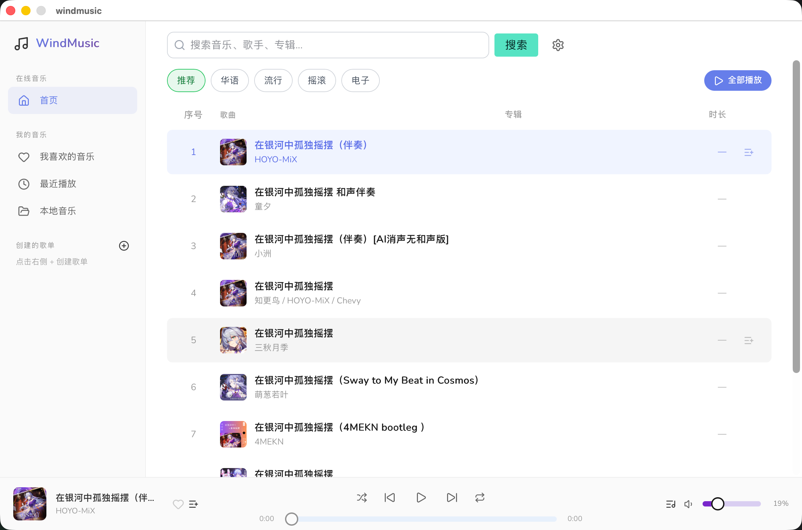
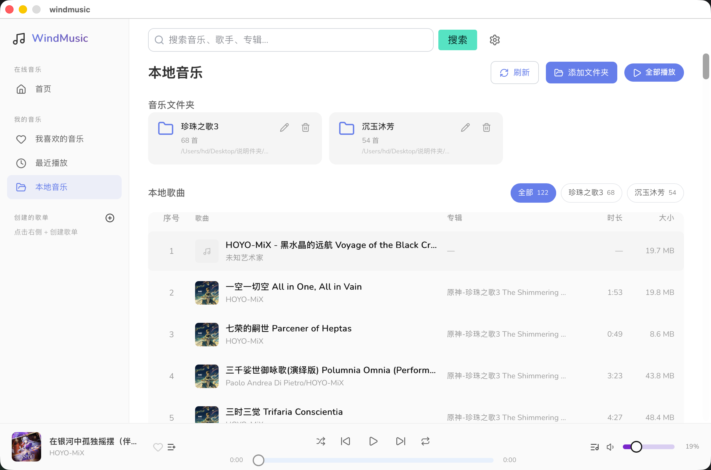
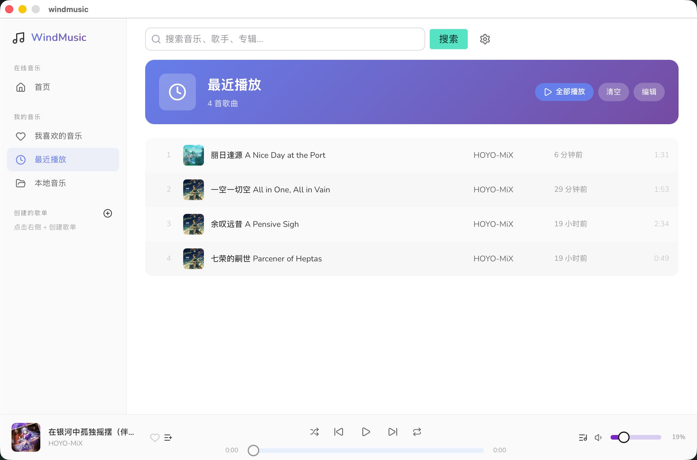

# WindMusic

基于 [Wails v2](https://wails.io/) 的跨平台桌面音乐客户端。前端负责界面与音频播放，Go 后端负责 Meting 网络源数据拉取、本地音乐库扫描，以及收藏、歌单、最近播放等持久化。

前端使用 **Bun** 作为 JavaScript 运行时与包管理器（见 `wails.json` 中的 `frontend:install` / `frontend:build` 配置）。

## 截图

| 首页发现 | 本地音乐 | 最近播放 |
|:---:|:---:|:---:|
|  |  |  |

## 功能概览

| 模块 | 说明 |
|------|------|
| **首页发现** | 推荐 / 华语 / 流行 / 摇滚 / 电子等分类 Tab，通过 Meting 搜索拉取曲目，Go 端内存缓存 |
| **搜索** | 关键词搜索、分页；顶栏全局搜索框快捷进入 |
| **播放** | 底部播放条：播放/暂停、进度、音量、上一首/下一首、随机/循环、播放队列 |
| **沉浸式歌词** | 歌曲详情页：频谱可视化 + LRC 歌词同步滚动，点击歌词可跳转 |
| **我喜欢的音乐** | 收藏管理，支持编辑、全选、批量删除 |
| **最近播放** | 开始播放时自动记录，支持清空与编辑 |
| **自建歌单** | 创建、删除歌单，向歌单添加/移除歌曲，侧边栏快速访问 |
| **本地音乐** | 添加/移除文件夹、扫描 MP3/FLAC/M4A 等格式、文件夹别名、按目录 Tab 筛选、读取内嵌封面与歌词 |
| **设置** | 配置多个 Meting API 节点，添加、删除、切换当前节点；显示应用数据目录 |
| **占位页面** | 推荐歌单、排行榜页面已预留路由，尚未接入后端 |

## 技术栈

| 层级 | 技术 |
|------|------|
| 桌面壳 | Wails v2、Go 1.23 |
| 前端 | Svelte 5、TypeScript、Vite 8、Tailwind CSS 4 |
| 路由 | svelte-spa-router（Hash 路由） |
| UI | Lucide 图标、Skeleton UI |
| JS 运行时 / 包管理 | [Bun](https://bun.sh/) |

## 架构

```
┌─────────────────────────────────────────────────────────┐
│  Svelte 前端                                             │
│  · 页面 / 组件 / 全局 stores                             │
│  · HTMLAudioElement 实际解码与播放（audioEngine）          │
│  · 数据由 Go 经 Wails Events 推送，JSON 持久化在后端       │
└───────────────────────┬─────────────────────────────────┘
                        │ Wails Bind（wailsjs/go/main/App）
┌───────────────────────▼─────────────────────────────────┐
│  Go 后端（app*.go → music/ → internal/）                  │
│  · Search / GetMusicURL / GetLyric / GetPic               │
│  · 本地库扫描、Meting 源、收藏、歌单、播放器设置等          │
└───────────────────────┬─────────────────────────────────┘
                        │ HTTP / 本地文件
┌───────────────────────▼─────────────────────────────────┐
│  Meting API 节点 · 本地音频文件夹                          │
└─────────────────────────────────────────────────────────┘
```

**职责边界**

1. 用户在 UI 选择曲目，前端组装 `sourceId`、`platform`、`metaJson`。
2. 在线播放地址、歌词、封面由 Go 调用 Meting 逻辑后返回；本地曲目通过 `GetLocalAudioStream` 提供可播放 URL。
3. **Go 不解码、不播放音频**；`stores/playback/audioEngine.ts` 中的 `<audio>` 是唯一播放执行者。
4. 队列、随机、循环等状态集中在 `stores/playback/player.svelte.ts`。

**播放数据流**

```
选曲 → player.svelte（队列/当前曲）
     → GetMusicURL / GetLocalAudioStream → 设置 audio.src → play
     → GetLyric / GetPic / GetLocalSongExtras（按需）
     → RecordRecent / 收藏状态同步
```

**音源标识**

- Meting 节点：`meting::<baseURL>`（例如 `meting::https://meting.mikus.ink`）
- 本地文件：`local` 平台，通过文件路径标识
- 未配置 Meting 时，搜索页可能回退 `builtin::network`；收藏封面等能力则要求先在设置中配置节点

当前 Meting 搜索面向 **网易云**（`platform=netease`）。

## 目录结构

```
windmusic/
├── main.go                 # Wails 入口，嵌入 frontend/dist
├── app.go                  # 核心导出方法（搜索、URL、歌词、封面）
├── app_library.go          # 收藏、最近播放、歌单
├── app_local.go            # 本地音乐库
├── app_settings.go         # Meting / 播放器 / 发现页缓存
├── app_sync.go             # 启动时数据推送与事件 emit
├── music/                  # 后端业务层
│   ├── appdata/            # 应用数据目录
│   ├── cache/              # 内存缓存（发现页推荐）
│   ├── events/             # Wails 事件名常量
│   ├── local/              # 本地文件夹扫描与元数据
│   ├── meting/             # Meting 搜索与 URL 解析
│   └── persist/            # JSON 持久化（收藏、歌单、设置等）
├── internal/
│   ├── music/              # 共享模型（SongItem、LocalSong 等）
│   └── musicsearch/        # Meting HTTP 客户端
├── frontend/               # Svelte 5 前端（Bun 管理依赖）
│   ├── src/
│   │   ├── pages/          # 页面（discover、search、library、settings…）
│   │   ├── components/     # 可复用 UI 组件
│   │   ├── stores/         # 全局状态（playback、library、sources、sync）
│   │   └── lib/            # 工具与 Wails 封装
│   └── wailsjs/            # Wails 生成绑定（勿手改）
├── images/                 # 软件截图（README 展示用）
├── build/                  # 各平台打包资源
├── wails.json
└── AGENTS.md               # 面向 AI 助手的开发约定
```

## 前端路由

| 路径 | 页面 |
|------|------|
| `/`、`/discover` | 首页发现 |
| `/search` | 搜索（`#search?q=关键词&page=1`） |
| `/favorites` | 我喜欢的音乐 |
| `/recent` | 最近播放 |
| `/local` | 本地音乐 |
| `/playlist/:id` | 自建歌单详情 |
| `/recommend`、`/ranking` | 推荐/排行榜（占位） |
| `/settings` | Meting 源与数据目录 |

顶栏搜索框右侧齿轮进入设置。

## 环境要求

- [Go](https://go.dev/) 1.23+
- [Wails CLI](https://wails.io/docs/gettingstarted/installation) v2
- [Bun](https://bun.sh/) — 前端依赖安装、开发服务器与构建（`wails.json` 已配置）

## 开发

```bash
# 安装前端依赖（Bun）
bun install --cwd frontend

# 推荐：完整桌面应用热重载
wails dev
```

仅前端（不启动 Wails 窗口时）：

```bash
bun run --cwd frontend dev
bun run --cwd frontend check   # svelte-check 类型检查
```

`wails dev` 启动后，也可在浏览器访问 Vite 开发地址（终端会打印，常见为 `http://localhost:34115`）调试前端；调用 Go 方法仍需 Wails 运行时。

**首次使用前**：进入 **设置**，添加至少一个 Meting API 地址（如 `https://meting.mikus.ink`），并点击设为当前。

## 构建

```bash
wails build
```

产物为当前平台可执行文件。构建时 Wails 会先在前端目录执行 `bun install` 与 `bun run build` 生成 `frontend/dist`，再由 Go `embed` 打包进二进制。

## 发布（GitHub Releases）

修改 `wails.json` 中的 `info.productVersion` 并推送到 `main` 分支后，GitHub Actions 会自动检测版本变更、在 macOS / Windows / Linux 上构建，并创建对应 Release。

```bash
# 1. 编辑 wails.json → info.productVersion（例如 1.0.5）
# 2. 提交并推送
git add wails.json
git commit -m "chore: release v1.0.5"
git push origin main
```

仅当 `productVersion` **相对上一提交发生变化** 时才会打包；若只改了 `wails.json` 的其他字段（如 author），不会触发发布。

| 平台 | 产物 |
|------|------|
| macOS (Universal) | `windmusic-v{version}-macos-universal.zip` |
| Windows (amd64) | `windmusic-amd64-installer.exe`（NSIS 安装包） |
| Linux (amd64) | `windmusic-v{version}-linux-amd64.tar.gz` |

Release 标签为 `v{productVersion}`（如 `v1.0.5`）。也可在 GitHub **Actions → Release → Run workflow** 手动触发，版本号读取当前 `wails.json`。

## 数据存储

### 应用数据目录（Go 读写）

根目录：`os.UserConfigDir()/windmusic`（设置页也会显示 `GetSourceDataDir()` 返回的完整路径）

| 文件 | 内容 |
|------|------|
| `favorites.json` | 收藏列表 |
| `recent.json` | 最近播放 |
| `playlists.json` | 自建歌单 |
| `player-settings.json` | 音量、静音、随机、循环模式 |
| `meting-settings.json` | Meting 节点列表与当前节点 |
| `local-folders.json` | 本地音乐扫描的文件夹列表 |
| `local-scan-cache.json` | 本地扫描结果缓存 |
| `local-scan-extras.json` | 本地封面、歌词等扩展数据 |

各平台常见路径：

- **macOS**：`~/Library/Application Support/windmusic/`
- **Windows**：`%AppData%\windmusic\`
- **Linux**：`~/.config/windmusic/`（或 `$XDG_CONFIG_HOME/windmusic/`）

## Go API（Wails 绑定）

<details>
<summary>展开完整 API 列表</summary>

| 方法 | 作用 |
|------|------|
| `Search` | 按音源、平台、关键词分页搜索 |
| `GetMusicURL` | 从 `metaJson` 解析在线播放地址 |
| `GetLyric` | 拉取 LRC 歌词 |
| `GetPic` | 获取封面 URL |
| `GetSourceDataDir` | 返回应用数据根目录 |
| `ListFavorites` / `AddFavorite` / `RemoveFavorite` / `IsFavorite` | 收藏 |
| `ListRecent` / `RecordRecent` / `RemoveRecent` / `ClearRecent` | 最近播放 |
| `ListPlaylists` / `CreatePlaylist` / `GetPlaylist` / `DeletePlaylist` | 歌单 |
| `AddPlaylistSong` / `RemovePlaylistSong` | 歌单曲目管理 |
| `PickLocalMusicFolder` / `RemoveLocalMusicFolder` / `SetLocalFolderAlias` | 本地文件夹管理 |
| `ScanLocalLibrary` / `ListLocalLibrary` / `GetLocalFolderSongs` | 本地库扫描与查询 |
| `GetLocalAudioStream` / `GetLocalSongExtras` / `GetLocalSongCovers` | 本地播放与元数据 |
| `GetMetingSettings` / `AddMetingURL` / `RemoveMetingURL` / `SetActiveMetingURL` | Meting 源配置 |
| `GetPlayerSettings` / `UpdatePlayerSettings` | 播放器设置 |
| `GetDiscoverRecommendCache` / `SetDiscoverRecommendCache` | 发现页推荐缓存 |

</details>

## 相关文档

- [AGENTS.md](./AGENTS.md) — 仓库约定、校验清单、架构规则
- [Wails 文档](https://wails.io/docs/introduction)
- [Bun 文档](https://bun.sh/docs)
